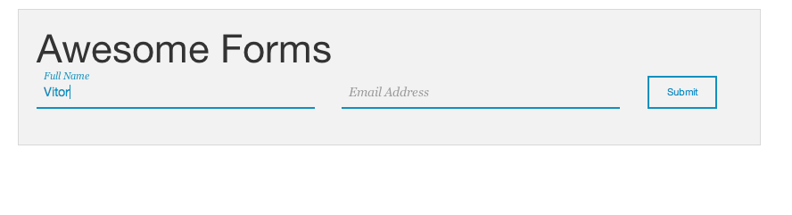

# Zurb Foundation Awesome Forms

Check also the [CodePen Pen] I created for this example.

Small project inspired from a [YouTube Tutorial] by [Dev Tips].

In the video Travis from [Dev Tips] as a guest on YouTube Channel [PHP Academy] shows how to implement a really cool way of animating a form and making a nice user experience. When the person click inside the input box the label that appears inside the input box eases out above the input box and stays there if there is content inside the input box otherwise the label goes back to the original place.

My take on it was to build the same thing but using a few more tools such as:
 - [Zurb Foundation] CSS Grid
 - Grunt (For which I used):
  - Grunt SASS - To compile the SCSS files
  - Grunt Uglify - To minify and uglify the JS Files
  - Grunt Watch to watch the changes being made to the files

This was my first time using Grunt as I mainly work with PHP and Wordpress and wanted to try out using Grunt on my own. Hope anyone likes this and you can customize it and optimize it.

License
----
MIT

**Thanks and enjoy it**

[CodePen Pen]: http://codepen.io/vitor_faiante/pen/ogWLrw
[YouTube Tutorial]: https://www.youtube.com/watch?v=PBGfqGANYNI
[Dev Tips]: https://www.youtube.com/user/DevTipsForDesigners
[PHP Academy]: https://www.youtube.com/user/phpacademy
[Zurb Foundation]: http://foundation.zurb.com/index.html